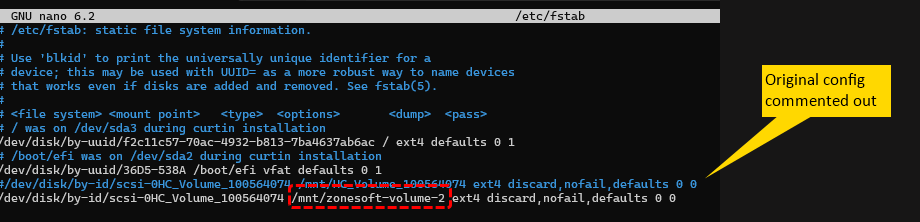
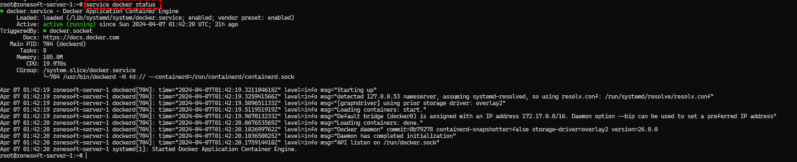
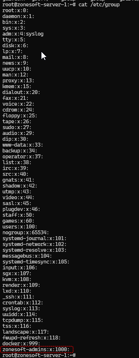
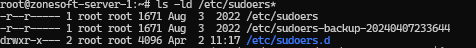
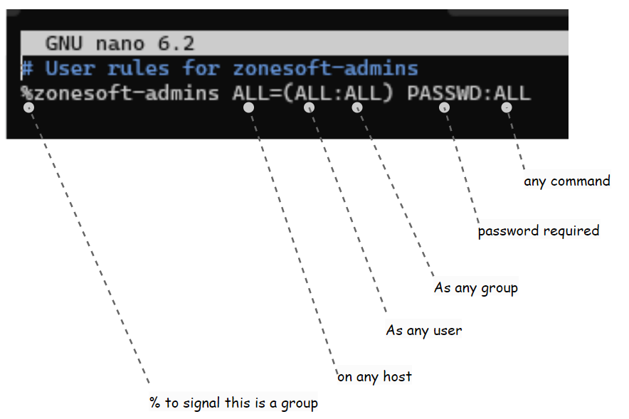

## reset ssh
`ssh-keygen -R 65.109.234.59`

## renaming mount point of the mounted volume
[See this stack-overflow answer](https://stackoverflow.com/a/40118578/16868620)
 
Step-1. `mkdir /mnt/zonesoft-volume-2`
 
Step-2. `umount /mnt/HC_Volume_100564074`
 
Step-3. Edit /etc/fstab `nano /etc/fstab`

 
Step-4. `mount /mnt/zonesoft-volume-2`
 
Step-5. `rmdir /mnt/HC_Volume_100564074/`
 

## checking the status of the docker daemon
run `service docker status`
 

 

## create the zonesoft-admins group
run `groupadd zonesoft-admins`
 

## check group is created
run `cat /etc/group`
 

## granting sudo access to a group (e.g. zonesoft-admins group)
For low down on sudo access (see this article)[https://ostechnix.com/allow-or-deny-sudo-access-to-a-group-in-linux/]
 
Granting sudo access requires editing the sudoers file. However, because this is a critical file and if messed up can render a system unsuable it is not edited directly but using an intermediary tool such as visudo. 
 
As further precaution the file is backed up using -a or --archive option. The -a option copies the file/directory with the same permission settings and metadata as the original. It preserve as much as possible of the structure and attributes of the original files in the copy: same directory tree, same file types, same contents, same metadata (times, permissions, extended attributes, etc.).
step-1. Backup the sudoers file with `cp --archive /etc/sudoers /etc/sudoers-backup-$(date +"%Y%m%d%H%M%S")`
 
step-2. Check backup is there with `ls -ld /etc/sudoers*` 

 
step-3. Create zonesoft-uids file in the sudoers.d subfolder with `visudo -f /etc/sudoers.d/zonesoft-uids`. This file twill be included into sudoers automatically.

 

