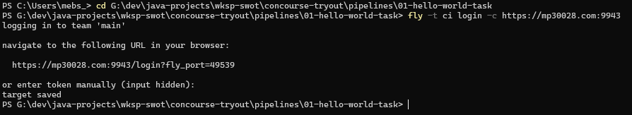
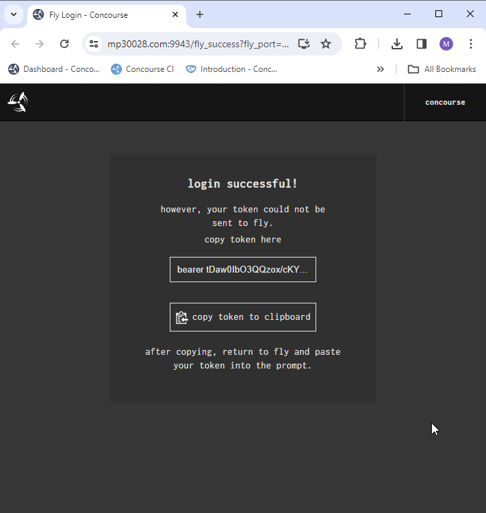
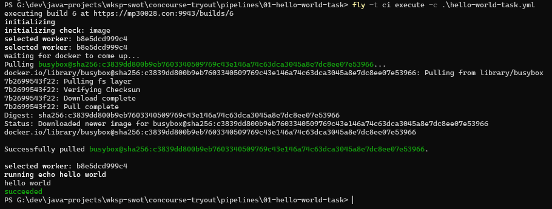

## Tasks
Tasks are the central concept in Concourse.
They can be run directly or from within jobs in a pipeline.

## Running a task directly

#### Step-1. Login
`fly -t ci login -c https://mp30028.com:9943`  
  
 

#### Step-2. Execute the task
`fly -t ci execute -c hello-world-task.yml`  

